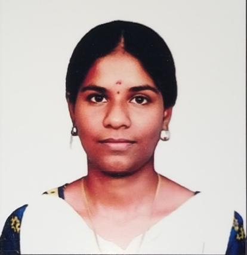

<!DOCTYPE html>
<html lang="en">
<header>
  
    <h1>Muthumeena Arumugam</h1>
    
M.Sc Computer Science Graduate

  
kanaku832@gmail.com

  <href>https://www.linkedin.com/in/muthumeena-arumugam-a43713297</href>
</header>

<section>
    <h2>About Me</h2>
    
An analytical M.Sc Computer Science graduate with strong problem-solving skills and a solid foundation in programming, databases, and software development. Quick learner with the ability to adapt to new technologies and work in team environments. Seeking an entry-level role to apply technical skills and contribute to organizational success.

</section>

<section>
    <h2>Skills</h2>
    <ul>
        <li><strong>Programming:</strong> Python, SQL</li>
        <li><strong>Tools:</strong> MS Excel (Pivot Tables, VLOOKUP), Power BI, Jupyter Notebook</li>
        <li><strong>Database:</strong> MySQL, SQL Joins, Aggregations</li>
        <li><strong>Analytics:</strong> Data Cleaning, EDA, Data Visualization</li>
        <li><strong>AI & Productivity Tools:</strong> ChatGPT, Gemini, Notebook LM</li>
    </ul>
</section>

<section>
    <h2>Experience</h2>
    

        <h3>Full Stack Development Intern, Educer Company</h3>
        
<em>2025</em> 
        Worked on web applications and gained exposure to structured data handling.

    

</section>

<section>
    <h2>Projects</h2>
    

        <h3>Fruit Quality Analysis using Deep Learning Techniques (Python)</h3>
        
<em>2026</em> 
        Developed model image-based fruit quality classification. Applied data preprocessing and feature extraction for model training.

    

    

        <h3>Online Evaluation Portal (Python, SQL)</h3>
        
<em>2024</em> 
        Built a database system to store and analyze student evaluation data.

    

</section>

<section>
    <h2>Education</h2>
    

        
<strong>M.Sc Computer Science</strong>, Sri Meenakshi Government Arts College For Women (A) | <em>2024-2026</em> | CGPA: 8.7

        
<strong>B.Sc Computer Science</strong>, Sri Meenakshi Government Arts College For Women (A) | <em>2021-2024</em> | CGPA: 8.8

        
<strong>HSC</strong>, M.A.N.U Girls Higher Secondary School | <em>2021</em> | Grade: 88%

        
<strong>SSLC</strong>, M.A.N.U Girls Higher Secondary School | <em>2019</em> | Grade: 88%

    

</section>

<footer>
    &copy; 2026 Muthumeena Arumugam
</footer>

</body>
</html>
